<h1 align="center">
  <br>
  <span>Cypher</span>
  <br>
 
 
[]( https://flutter.dev/ "Flutter")[](https://www.javascript.com/ "Javascript")[](https://nodejs.org/en/ "NodeJS")[](https://www.mongodb.com/ "MongoDB")
</h1>
<span><h4 align="center">Easy, secure, end to end encrypted (E2EE) messenger.</h4></span>

<p align="justify">
Cypher, is an end-to-end encrypted secured instant messaging application that would encrypt the user’s chats and media with the use of various secured methods that would prevent any kind of data breach.
<p>


* Every message is encrypted from sender to recipient. There is no way to send a plain text message in them and Cypher's servers cannot decrypt them.


The Cypher Encryption Scheme has a couple key requirements that secure your data.

1. The server must never know your password.
2. The server must never know your private key.


## How the Cypher Encryption Scheme Works

For successful end to end encryption, private-public key pair is used. It is important to store these in such a way that server doesn't have full information required
to decrypt messages stored in server.
The method used to securely store these keys is as follows.

### Upon Registration

When a user registers, the client must:

1. Hash the password that the user entered, using a cryptographically secure, one way hashing algorithm.
2. Derive an encryption key and a remainder from the hash. Neither the key nor the password should be practically derivable from just the remainder. The method Cypher uses:
  * Remove some portion from the hash as the key. The remaining portion becomes the remainder. *Cypher removes the first 24 bytes as user's password and the next 16 bytes as encryption key.*
3. Send the first 24 bytes from step 2 i.e the password to the server as the user's password.
4. Generate a public/private key pair.
5. Encrypt the private key with the encryption key it derived from the password hash using a symmetric encryption algorithm. 
6. Send the encrypted private key and clear text public key to the server.

### Upon Login

When a user logs in, the client must:

1. Complete steps 1-3 of the registration process in order to authenticate the user.
2. Retrieve the user's encrypted private key and clear text public key from the server.
3. Use the key taken from the password hash to decrypt the private key.


## Functions implemented
- End to end encrypted chatting
- **Schedule message** for any user from your contact bbook who has registered into our application
- Agora video call
- Media and location sharing
- Self profile update or visit other user's profile
- Forgot password/reset password
- Delete chats with a particular user
- Delete account
- Logout from current device or from all devices user has logged into


### Screenshots ###
----------------------------------------------------------------------------------------
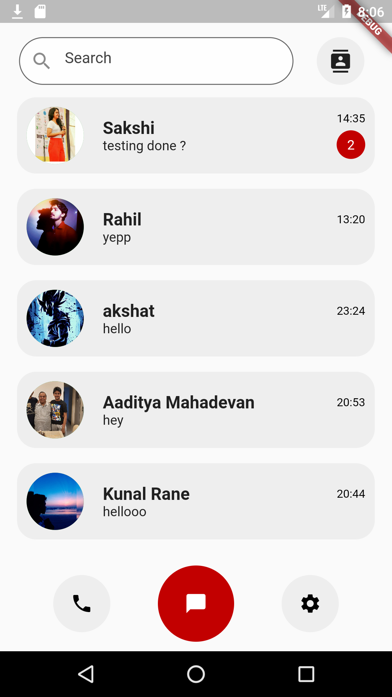&nbsp;&nbsp;&nbsp;&nbsp;&nbsp;&nbsp;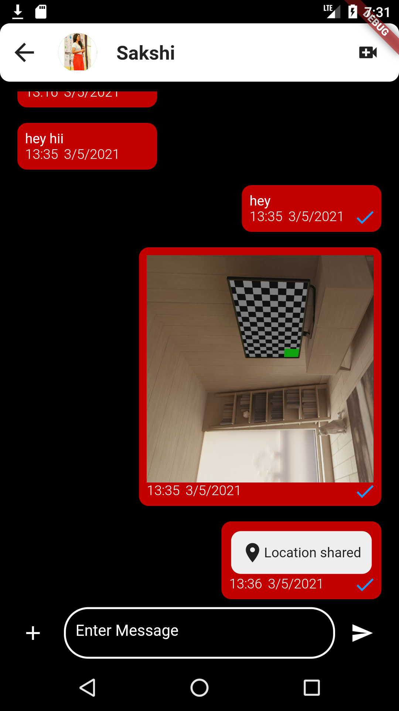&nbsp;&nbsp;&nbsp;&nbsp;&nbsp;&nbsp;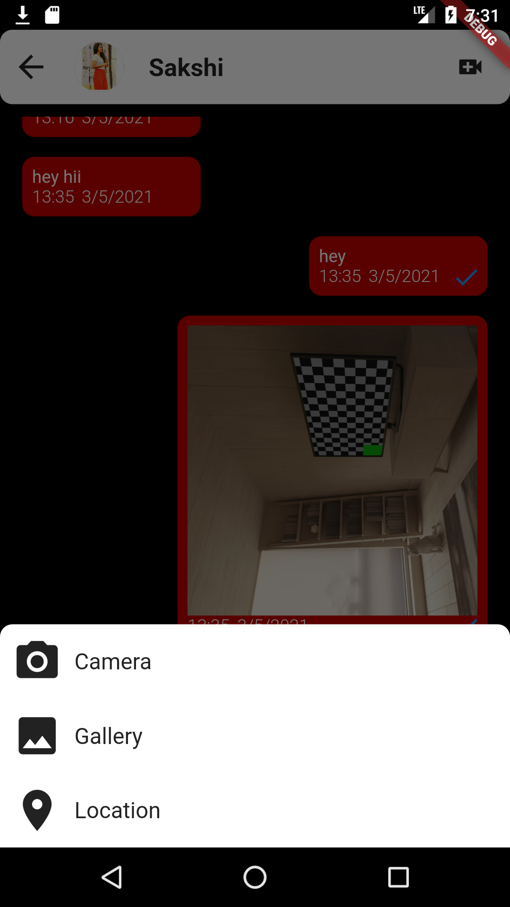
<br>
### Agora video call and call log ###
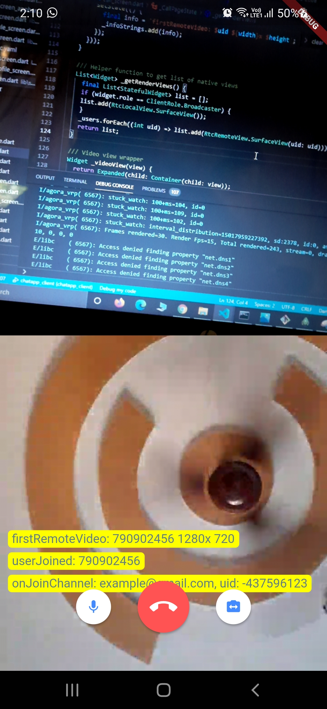&nbsp;&nbsp;&nbsp;&nbsp;&nbsp;&nbsp;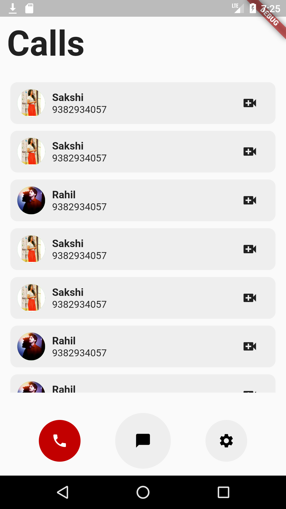
<br>
### Message scheduling for a contact and delete chat with a particular contact ###
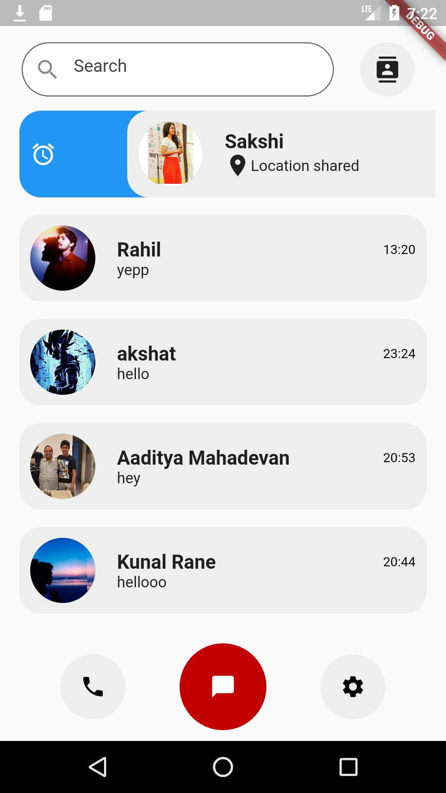&nbsp;&nbsp;&nbsp;&nbsp;&nbsp;&nbsp;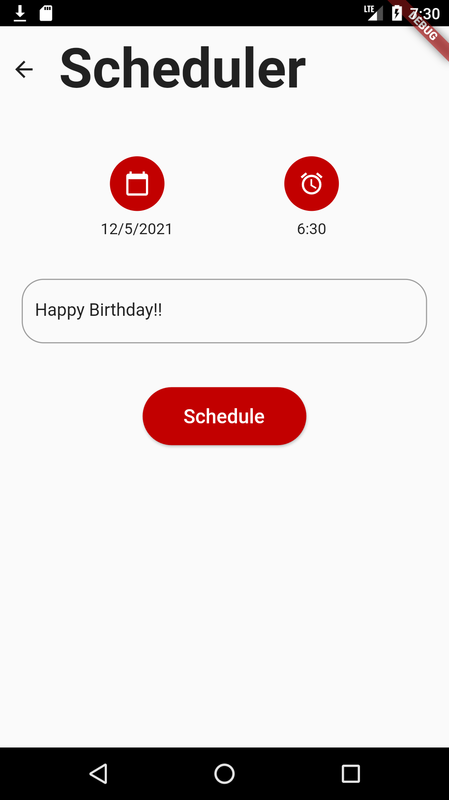&nbsp;&nbsp;&nbsp;&nbsp;&nbsp;&nbsp;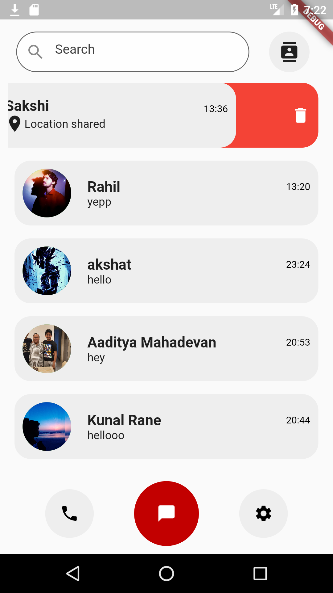

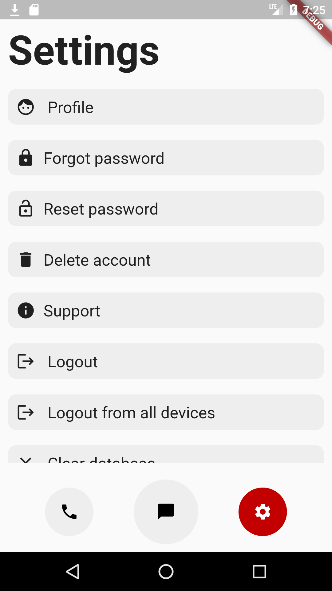&nbsp;&nbsp;&nbsp;&nbsp;&nbsp;&nbsp;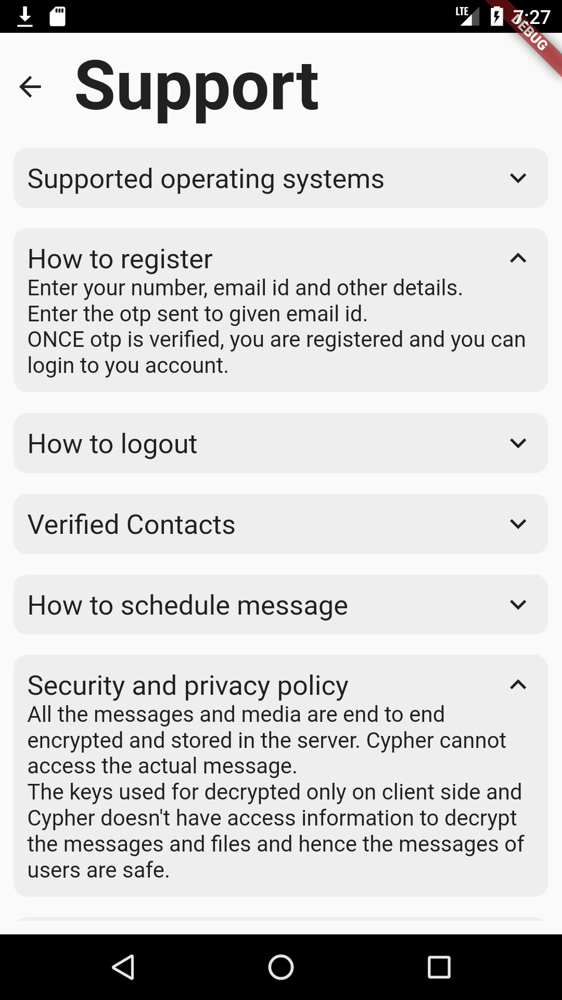
<br>
### Self profile update and view other user's profile ###
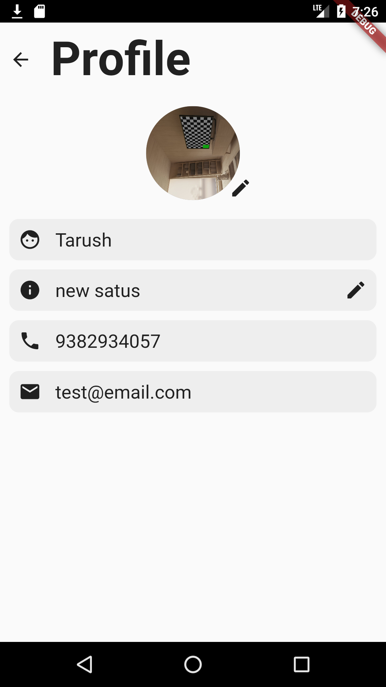&nbsp;&nbsp;&nbsp;&nbsp;&nbsp;&nbsp;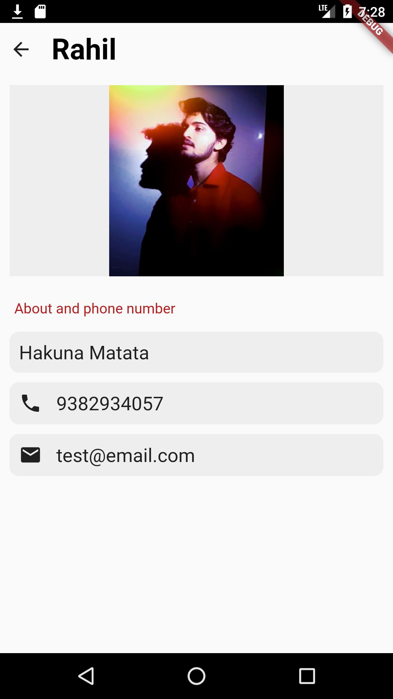
<br>
### Login, sign up and all users from contact book of logged in user who have registered into our app listed ###
&nbsp;&nbsp;&nbsp;&nbsp;&nbsp;&nbsp;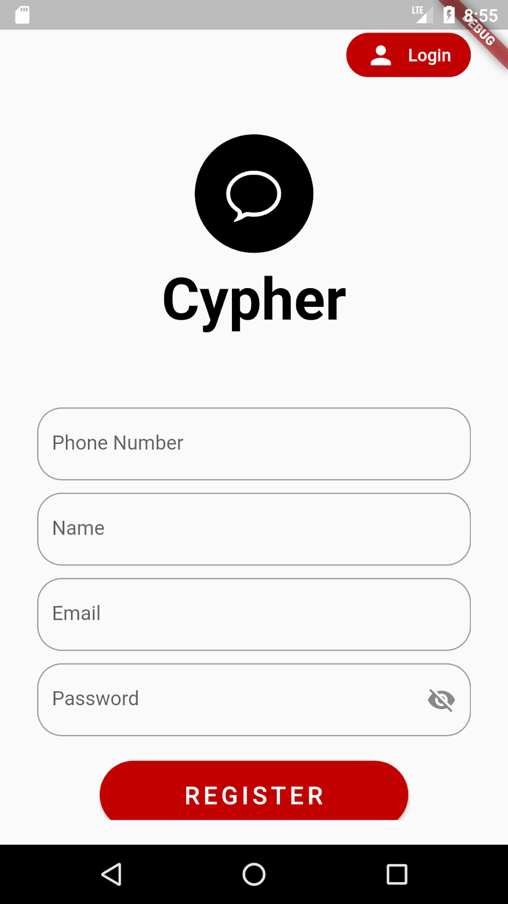&nbsp;&nbsp;&nbsp;&nbsp;&nbsp;&nbsp;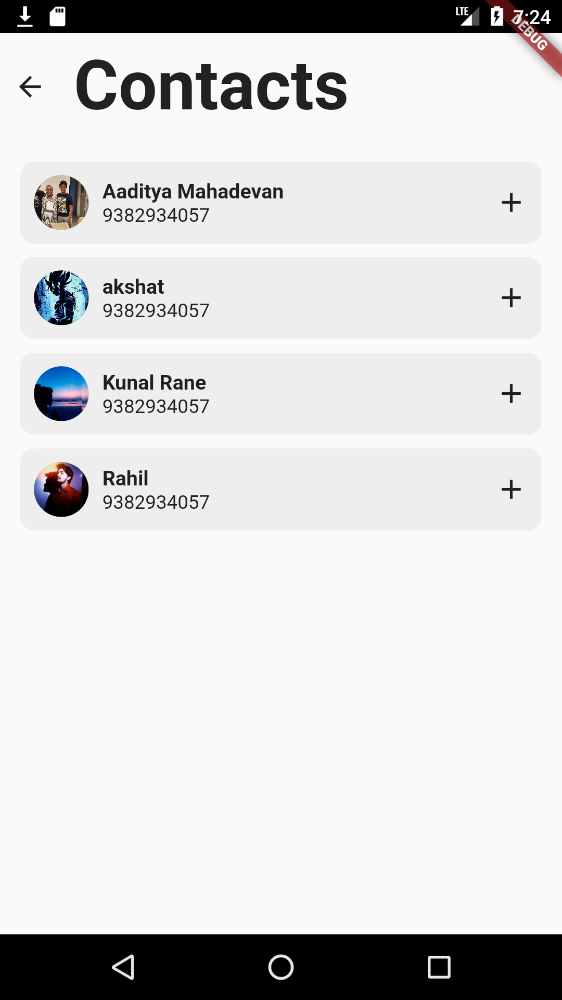

---------------------------------------------------------------------------------------

#### Installation
###### Client
Clone the repository and navigate to chatapp_client folder and run the flutter application after giving backend localhost/ngrok url in urls.dart

###### Backend
Clone the repository, navigate to chatapp_backend folder and run the following command-
```html
  npm run dev
```

###             Tech stack
`Backend` : Nodejs, sockets  <br>
`Database`: Mongodb <br>
`Frontend` : Flutter  <br>


<h3 align="center"><b>Developed with :heart: by <b><a href="https://github.com/tarush-r/">Tarush Rajput</a>, <b><a href="https://github.com/sakship31/">Sakshi Pandey</a>, <b><a href="https://github.com/Rahil-Parikh/">Rahil Parikh</a></b>, <b><a href="https://github.com/AkshatG6/">Akshat Gandhi</a></b> and <b><a href="https://github.com/kunal-16/">Kunal Rane</a></b></h3>


